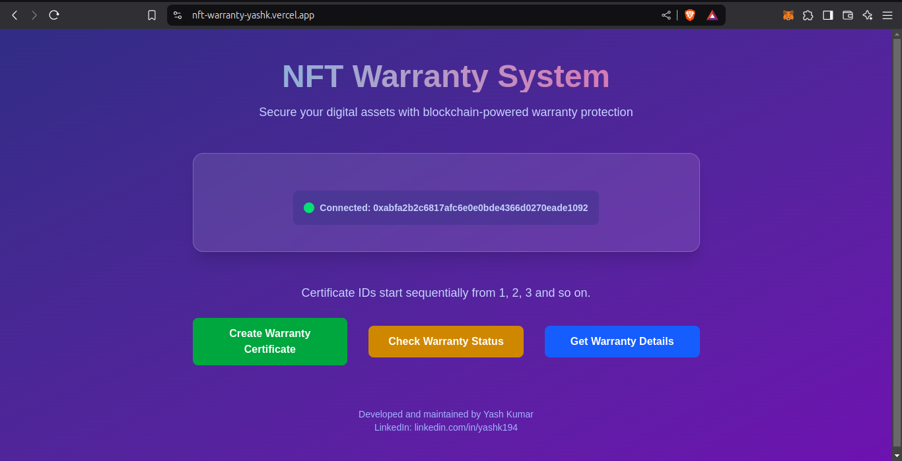
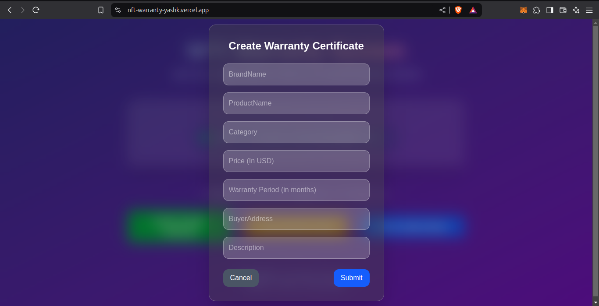
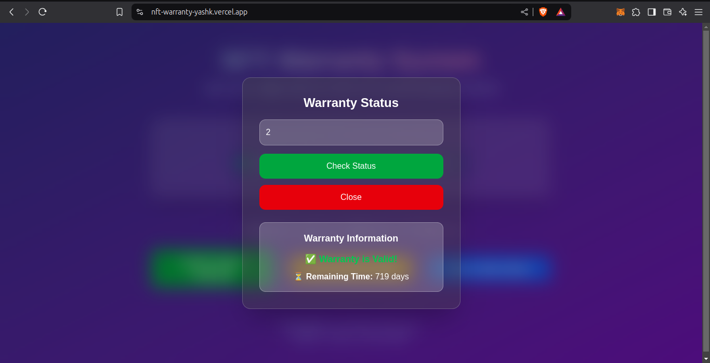
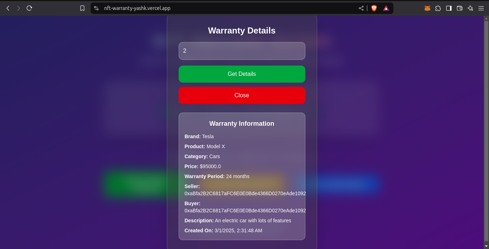

# NFT Warranty

## Overview

NFT Warranty is a blockchain-based warranty management system that utilizes NFTs to represent warranties. The project is built using Solidity and integrates with a Next.js frontend for seamless interaction.

## Features

- **Smart Contracts**: Developed in Solidity to manage warranty issuance and verification.
- **Unit Testing**: Uses Chai for comprehensive unit tests.
- **Development Environment**: Built with Hardhat for contract development and testing.
- **Deployment**: Uses Hardhat Ignition for automated deployment.
- **Etherscan Verification**: The smart contract is verified on Etherscan for transparency.
- **Frontend**: Developed using Next.js (React-based framework).
- **Hosting**: The frontend is deployed on Vercel for fast and reliable hosting.

## Technologies Used

- **Solidity**: Smart contract development
- **Hardhat**: Development and testing framework
- **Chai**: Unit testing
- **Hardhat Ignition**: Deployment automation
- **Next.js**: Frontend framework
- **Vercel**: Hosting platform

## Smart Contract

- **Contract Address (Sepolia)**: `0xDdB2255528C6D3d8418968704C5B26590b75413B`
- **Etherscan Link**: [https://sepolia.etherscan.io/address/0xDdB2255528C6D3d8418968704C5B26590b75413B](https://sepolia.etherscan.io/address/0xDdB2255528C6D3d8418968704C5B26590b75413B)

## Project Domain

- **Live Application**: [nft-warranty-yashk.vercel.app](https://nft-warranty-yashk.vercel.app/)

## Installation and Setup

### Prerequisites

Ensure you have the following installed:

- Node.js (latest LTS version)
- MetaMask (for interacting with the deployed contracts)

### Steps to Run Locally

1. Clone the repository:

   ```sh
   git clone https://github.com/YashK-194/nft-warranty.git
   cd nft-warranty
   ```

2. Check out the respective README files for backend and frontend setup:
   - [Backend README](backend/README.md)
   - [Frontend README](frontend/README.md)

## Screenshots






## License

This project is licensed under the MIT License.

## Contact

For any inquiries, reach out via GitHub, LinkedIn: [linkedin.com/in/yashk194](https://www.linkedin.com/in/yashk194/) or email at `yashkm194@gmail.com`.
